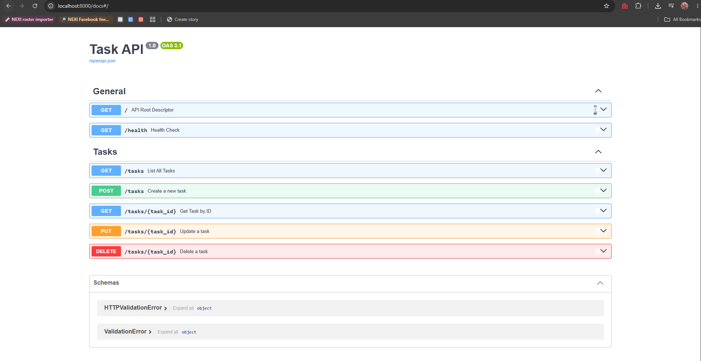

# 📋 Task Management REST API

A clean, in-memory CRUD REST API built with **Python 3.11** and **FastAPI**, featuring defensive input validation, standard HTTP status codes, and auto-generated interactive OpenAPI/Swagger UI documentation.

Built for **FlyRank AI Backend Engineering Internship — Week 2 (Assignment A1: Build your first CRUD API)**.

---

## 📸 Interactive Documentation (Swagger UI)

FastAPI automatically serves interactive OpenAPI documentation at `/docs`:



---

## 🚀 Quickstart: How to Run Locally

### Prerequisites
- **Python 3.10+** (tested on Python 3.11)

### 1. Clone the Repository
```bash
git clone https://github.com/PatrickIlagan/flyrank-backend-ai-intern.git
cd "flyrank-backend-ai-intern/Week 2/backend"
```

### 2. Set Up Virtual Environment
```powershell
# Windows (PowerShell)
python -m venv venv
.\venv\Scripts\Activate.ps1

# Git Bash / Linux / macOS
python -m venv venv
source venv/Scripts/activate # or source venv/bin/activate on Linux/macOS
```

### 3. Install Dependencies
```bash
pip install -r requirements.txt
```

### 4. Start the Server
```bash
uvicorn main:app --reload --port 8000
```

- **Base API URL:** `http://localhost:8000`
- **Interactive Swagger UI:** `http://localhost:8000/docs`
- **ReDoc Documentation:** `http://localhost:8000/redoc`

---

## 📡 API Endpoints Reference

| Method | Endpoint | Description | Success Status | Error Status Codes |
| :--- | :--- | :--- | :--- | :--- |
| `GET` | `/` | API root descriptor and manifest | `200 OK` | — |
| `GET` | `/health` | Server health check for uptime monitoring probes | `200 OK` | — |
| `GET` | `/tasks` | Retrieve all in-memory tasks | `200 OK` | — |
| `GET` | `/tasks/{id}` | Retrieve a single task by its numeric ID | `200 OK` | `404 Not Found` |
| `POST` | `/tasks` | Create a new task (requires non-empty `title` string) | `201 Created` | `400 Bad Request` |
| `PUT` | `/tasks/{id}` | Update an existing task's `title` and/or `done` status | `200 OK` | `400 Bad Request`, `404 Not Found` |
| `DELETE` | `/tasks/{id}` | Delete a task from memory by ID | `204 No Content` | `404 Not Found` |
| `GET` | `/docs` | Interactive Swagger UI documentation playground | `200 OK` | — |

---

## 🧪 Verified `curl -i` Checkpoint Outputs

### 1. Root Descriptor (`GET /`)
```bash
curl.exe -i http://localhost:8000/
```
```http
HTTP/1.1 200 OK
date: Thu, 27 Aug 2026 07:41:45 GMT
server: uvicorn
content-length: 58
content-type: application/json

{"name":"Task API","version":"1.0","endpoints":["/tasks"]}
```

---

### 2. Health Check (`GET /health`)
```bash
curl.exe -i http://localhost:8000/health
```
```http
HTTP/1.1 200 OK
date: Thu, 27 Aug 2026 07:41:51 GMT
server: uvicorn
content-length: 15
content-type: application/json

{"status":"ok"}
```

---

### 3. List All Tasks (`GET /tasks`)
```bash
curl.exe -i http://localhost:8000/tasks
```
```http
HTTP/1.1 200 OK
date: Thu, 27 Aug 2026 07:53:17 GMT
server: uvicorn
content-length: 159
content-type: application/json

[{"id":1,"title":"Buy groceries","done":false},{"id":2,"title":"Read Week 2 Documentation","done":true},{"id":3,"title":"Build my own portfolio","done":false}]
```

---

### 4. Read Single Task by ID (`GET /tasks/1`)
```bash
curl.exe -i http://localhost:8000/tasks/1
```
```http
HTTP/1.1 200 OK
date: Thu, 27 Aug 2026 07:53:20 GMT
server: uvicorn
content-length: 45
content-type: application/json

{"id":1,"title":"Buy groceries","done":false}
```

---

### 5. 404 Not Found Handling (`GET /tasks/99`)
```bash
curl.exe -i http://localhost:8000/tasks/99
```
```http
HTTP/1.1 404 Not Found
date: Thu, 27 Aug 2026 07:53:23 GMT
server: uvicorn
content-length: 29
content-type: application/json

{"error":"Task 99 not found"}
```

---

### 6. Create Task with 201 Created (`POST /tasks`)
```bash
curl.exe -i -X POST http://localhost:8000/tasks -H "Content-Type: application/json" -d '{"title": "Buy milk"}'
```
```http
HTTP/1.1 201 Created
date: Thu, 27 Aug 2026 08:05:36 GMT
server: uvicorn
content-length: 40
content-type: application/json

{"id":4,"title":"Buy milk","done":false}
```

---

### 7. Input Validation & 400 Bad Request (`POST /tasks` with empty body)
```bash
curl.exe -i -X POST http://localhost:8000/tasks -H "Content-Type: application/json" -d '{}'
```
```http
HTTP/1.1 400 Bad Request
date: Thu, 27 Aug 2026 08:04:41 GMT
server: uvicorn
content-length: 49
content-type: application/json

{"error":"Title is required and cannot be empty"}
```

---

### 8. Update Task (`PUT /tasks/1`)
```bash
curl.exe -i -X PUT http://localhost:8000/tasks/1 -H "Content-Type: application/json" -d '{"title": "Buy oat milk", "done": true}'
```
```http
HTTP/1.1 200 OK
date: Thu, 27 Aug 2026 08:26:45 GMT
server: uvicorn
content-length: 47
content-type: application/json

{"id":1,"title":"Buy oat milk","done":true}
```

---

### 9. Delete Task with 204 No Content (`DELETE /tasks/1`)
```bash
curl.exe -i -X DELETE http://localhost:8000/tasks/1
```
```http
HTTP/1.1 204 No Content
date: Thu, 27 Aug 2026 08:27:00 GMT
server: uvicorn
```

