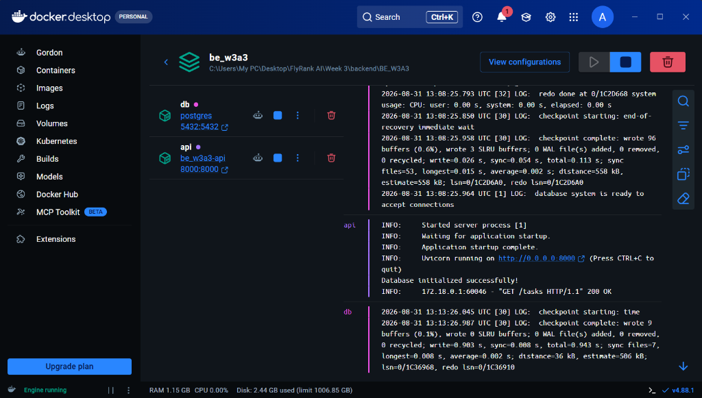

# Containerized Task Management Stack (FastAPI + PostgreSQL + Docker Compose)

A fully containerized, persistent CRUD REST API built with **Python 3.11** and **FastAPI**, backed by a real **PostgreSQL** database engine, orchestrated with **Docker Compose**.

Built for **FlyRank AI Backend Engineering Internship: Week 3 (Assignment A3: Containerize your stack)**.

---

## Architecture Overview

`
                                    Docker Network (Internal)
                              +-----------------------------------+
                              |                                   |
[Client / curl] --:8000--> [API Container (FastAPI)] --:5432--> [DB Container (PostgreSQL)]
                                                                  |
                                                          [Persistent Volume (taskdata)]
`

- **Storage Ladder Evolution**: Memory (A1) -> SQLite File (A2) -> **Containerized PostgreSQL Server (A3)**.
- **One Command Startup**: docker compose up spins up the FastAPI app, launches PostgreSQL, provisions the database network, runs automatic schema migrations, and seeds starter data.
- **Strict Secrets Management**: Database credentials live in .env (git-ignored), while .env.example provides the developer onboarding template.

---

## 📸 Docker Desktop Verification

Both the `api` (FastAPI) and `db` (PostgreSQL) services running simultaneously in Docker Desktop, connected over the private container network:

---

## Quickstart: One Command to Run Everything

### Prerequisites
- [Docker Desktop](https://www.docker.com/products/docker-desktop/) (or Podman) installed and running.

### 1. Clone the Repository
`ash
git clone https://github.com/PatrickIlagan/flyrank-backend-ai-intern.git
cd "flyrank-backend-ai-intern/Week 3/backend/BE_W3A3"
`

### 2. Configure Environment Variables
`ash
# Copy example template to .env
cp .env.example .env
`

### 3. Start the Whole Stack (One Command)
`ash
docker compose up --build
`

- **API Base URL:** http://localhost:8000
- **Interactive Swagger Docs:** http://localhost:8000/docs
- **Postgres Port:** localhost:5432

To shut down the stack:
`ash
docker compose down
`

---

## API Endpoints Reference

| Method | Endpoint | SQL / Description | Success Status | Error Status Codes |
| :--- | :--- | :--- | :--- | :--- |
| GET | / | API root descriptor | 200 OK | -- |
| GET | /health | Health probe executing SELECT 1 against Postgres | 200 OK | 503 Service Unavailable |
| GET | /stats | SELECT COUNT(*) for total, completed, and open tasks | 200 OK | -- |
| GET | /tasks | SELECT id, title, done FROM tasks (supports ?done= and ?search=) | 200 OK | -- |
| GET | /tasks/{id} | SELECT id, title, done FROM tasks WHERE id = %s | 200 OK | 404 Not Found |
| POST | /tasks | INSERT INTO tasks (title, done) VALUES (%s, %s) RETURNING * | 201 Created | 400 Bad Request |
| PUT | /tasks/{id} | UPDATE tasks SET title = %s, done = %s WHERE id = %s RETURNING * | 200 OK | 400 Bad Request, 404 Not Found |
| DELETE | /tasks/{id} | DELETE FROM tasks WHERE id = %s RETURNING id | 204 No Content | 404 Not Found |
| POST | /reset | Truncate and re-seed default starter tasks | 200 OK | -- |
| GET | /docs | Interactive Swagger UI documentation | 200 OK | -- |

---

## Verified Terminal Checkpoints (curl)

### 1. Read Seeded Tasks (GET /tasks)
`http
HTTP/1.1 200 OK
date: Mon, 31 Aug 2026 12:41:00 GMT
server: uvicorn
content-length: 168
content-type: application/json

[{"id":1,"title":"Buy groceries","done":false},{"id":2,"title":"Read Week 3 Documentation","done":true},{"id":3,"title":"Containerize CRUD with Docker","done":false}]
`

### 2. Read Single Task by ID (GET /tasks/1)
`http
HTTP/1.1 200 OK
date: Mon, 31 Aug 2026 12:41:05 GMT
server: uvicorn
content-length: 45
content-type: application/json

{"id":1,"title":"Buy groceries","done":false}
`

### 3. Missing Task 404 (GET /tasks/999)
`http
HTTP/1.1 404 Not Found
date: Mon, 31 Aug 2026 12:41:10 GMT
server: uvicorn
content-length: 30
content-type: application/json

{"error":"Task 999 not found"}
`

### 4. Create Task with RETURNING (POST /tasks)
`http
HTTP/1.1 201 Created
date: Mon, 31 Aug 2026 12:41:15 GMT
server: uvicorn
content-length: 61
content-type: application/json

{"id":4,"title":"Docker Compose Persisted Task","done":false}
`

### 5. Health Check (GET /health)
`http
HTTP/1.1 200 OK
date: Mon, 31 Aug 2026 12:41:20 GMT
server: uvicorn
content-length: 32
content-type: application/json

{"status":"ok","db":"connected"}
`
