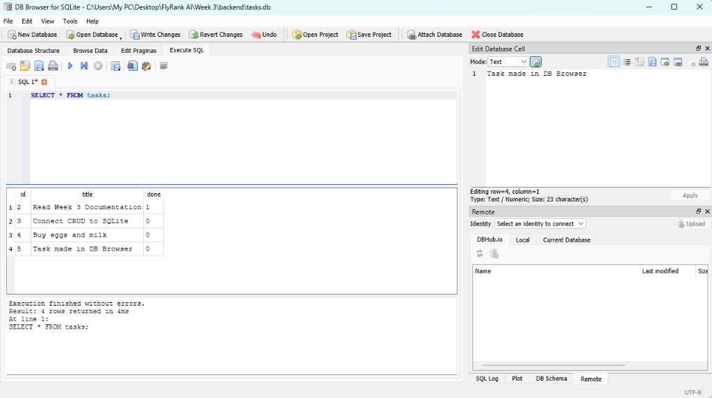

# 🗄️ Task Management Database API (SQLite)

A persistent CRUD REST API built with **Python 3.11** and **FastAPI**, backed by a local **SQLite** database (`tasks.db`). This project replaces Week 2's in-memory storage with disk-persisted relational data while preserving identical API contracts and status codes.

Built for **FlyRank AI Backend Engineering Internship - Week 3 (Assignment A2: Connecting your CRUD to the database)**.

---

## 📸 Database Inspection (DB Browser for SQLite)

The SQLite database file (`tasks.db`) can be inspected and queried directly using **DB Browser for SQLite**:



---

## 💡 Why SQLite Was Chosen

1. **Zero Configuration**: SQLite requires no external database server process, credentials, or cloud setup. The entire database is a single self-contained file on disk.
2. **True Persistence**: Unlike in-memory data that vanishes on server restart, SQLite writes every transaction permanently to disk.
3. **Automated Provisioning**: The application automatically creates `tasks.db`, sets up the `tasks` schema, and seeds default records on its first run with zero manual setup.
4. **Git-Ignored Clean State**: `tasks.db` is included in `.gitignore` so every new clone starts with a fresh, isolated database instance.

---

## 🚀 Quickstart: How to Run Locally

### Prerequisites
- Python 3.10+ (tested on Python 3.11)

### 1. Clone the Repository
```bash
git clone https://github.com/PatrickIlagan/flyrank-backend-ai-intern.git
cd "flyrank-backend-ai-intern/Week 3/backend"
```

### 2. Set Up Virtual Environment
```powershell
# Windows (PowerShell)
python -m venv venv
.\venv\Scripts\Activate.ps1

# Git Bash / Linux / macOS
python -m venv venv
source venv/Scripts/activate # or source venv/bin/activate on Linux/macOS
```

### 3. Install Dependencies
```bash
pip install -r requirements.txt
```

### 4. Start the Server (One Command)
```bash
uvicorn main:app --reload --port 8000
```

- **Base API URL:** `http://localhost:8000`
- **Interactive Swagger UI:** `http://localhost:8000/docs`

---

## 📡 API Endpoints Reference

| Method | Endpoint | SQL Query | Success Status | Error Status Codes |
| :--- | :--- | :--- | :--- | :--- |
| `GET` | `/` | — | `200 OK` | — |
| `GET` | `/health` | — | `200 OK` | — |
| `GET` | `/tasks` | `SELECT id, title, done FROM tasks` | `200 OK` | — |
| `GET` | `/tasks/{id}` | `SELECT id, title, done FROM tasks WHERE id = ?` | `200 OK` | `404 Not Found` |
| `POST` | `/tasks` | `INSERT INTO tasks (title, done) VALUES (?, ?)` | `201 Created` | `400 Bad Request` |
| `PUT` | `/tasks/{id}` | `UPDATE tasks SET title = ?, done = ? WHERE id = ?` | `200 OK` | `400 Bad Request`, `404 Not Found` |
| `DELETE` | `/tasks/{id}` | `DELETE FROM tasks WHERE id = ?` | `204 No Content` | `404 Not Found` |
| `GET` | `/docs` | — | `200 OK` | — |

---

## ⚡ Hand-Executed SQL Queries (Stage 4)

These queries were executed directly in **DB Browser for SQLite** to verify direct database access:

```sql
-- 1. List all tasks
SELECT * FROM tasks;

-- 2. Query only completed tasks
SELECT * FROM tasks WHERE done = 1;

-- 3. Count total tasks
SELECT COUNT(*) FROM tasks;

-- 4. Insert a task directly by hand
INSERT INTO tasks (title, done) VALUES ('Task made in DB Browser', 0);
```

**Single Source of Truth Observation**: When records are inserted or updated directly in DB Browser, subsequent `GET /tasks` API calls immediately reflect the changes without restarting the server.

---

## 🧪 Verified `curl -i` Checkpoint Outputs

### 1. Read Seeded Tasks (`GET /tasks`)
```bash
curl.exe -i http://localhost:8000/tasks
```
```http
HTTP/1.1 200 OK
date: Mon, 31 Aug 2026 07:57:01 GMT
server: uvicorn
content-length: 159
content-type: application/json

[{"id":1,"title":"Buy groceries","done":false},{"id":2,"title":"Read Week 3 Documentation","done":true},{"id":3,"title":"Connect CRUD to SQLite","done":false}]
```

### 2. Read Single Task by ID (`GET /tasks/1`)
```bash
curl.exe -i http://localhost:8000/tasks/1
```
```http
HTTP/1.1 200 OK
date: Mon, 31 Aug 2026 08:15:07 GMT
server: uvicorn
content-length: 45
content-type: application/json

{"id":1,"title":"Buy groceries","done":false}
```

### 3. Missing Task 404 (`GET /tasks/999`)
```bash
curl.exe -i http://localhost:8000/tasks/999
```
```http
HTTP/1.1 404 Not Found
date: Mon, 31 Aug 2026 08:15:07 GMT
server: uvicorn
content-length: 30
content-type: application/json

{"error":"Task 999 not found"}
```

### 4. Create Task (`POST /tasks`)
```bash
curl.exe -i -X POST http://localhost:8000/tasks -H "Content-Type: application/json" -d '{"title": "Buy eggs and milk"}'
```
```http
HTTP/1.1 201 Created
date: Mon, 31 Aug 2026 08:18:22 GMT
server: uvicorn
content-length: 49
content-type: application/json

{"id":4,"title":"Buy eggs and milk","done":false}
```

### 5. Delete Task (`DELETE /tasks/1`)
```bash
curl.exe -i -X DELETE http://localhost:8000/tasks/1
```
```http
HTTP/1.1 204 No Content
date: Mon, 31 Aug 2026 08:24:00 GMT
server: uvicorn
```
