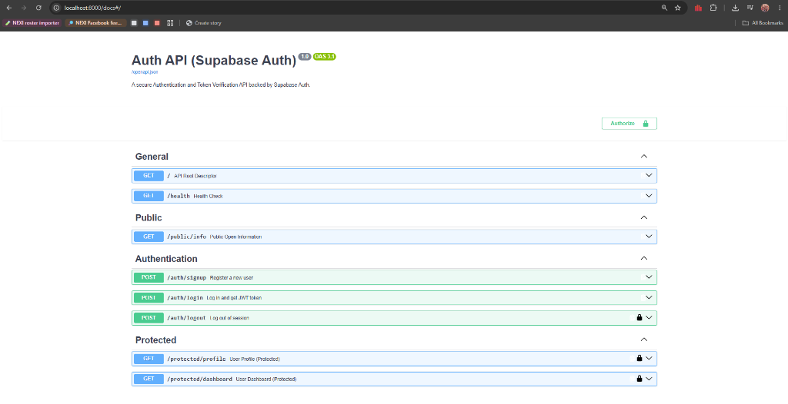

# 🛡️ Auth: Login & Protect (FastAPI + Supabase Auth + JWT)

A secure authentication and token-verification REST API built with **Python 3.11** and **FastAPI**, integrated with **Supabase Auth** as the trusted Identity Provider (IdP). This system handles user registration, secure password hashing, cryptographic JSON Web Token (JWT) issuance, and reusable Bearer token dependency guards.

Built for **FlyRank AI Backend Engineering Internship: Week 4 (Assignment A4: Auth - Login & protect)**.

---

## 📸 Interactive Documentation (Swagger UI)

FastAPI automatically generates interactive OpenAPI documentation with **HTTPBearer** security and the **Authorize** padlock at http://localhost:8000/docs:

---

## 🏗️ Architecture & The Trust Triangle

`	ext
                       +----------------------+
                       |    Supabase Auth     |
                       | (Identity Provider)  |
                       +----------+-----------+
                         ^                 ^
      1. Sign Up/Login   |                 | 4. Verify JWT Signature
      (email + password) |                 |    (supabase.auth.get_user)
                         v                 v
                   +----------+     +---------------+
                   |  Client  |---->|  FastAPI App  |
                   |  (curl)  |     |  (Backend)    |
                   +----------+     +---------------+
                     3. Authorization:
                        Bearer <access_token>
`

- **Identity Provider**: Supabase manages user accounts, securely hashes passwords, and signs JSON Web Tokens. No raw passwords are stored or handled directly on the custom server.
- **Stateless Verification**: Protected endpoints verify incoming Bearer tokens using supabase.auth.get_user(token).
- **Reusable Dependency Guard**: The get_current_user dependency in FastAPI stands as a protective shield in front of all private routes.

---

## 🚀 Quickstart: How to Run Locally

### Prerequisites
- Python 3.10+ (tested on Python 3.11)
- Free account at [Supabase](https://supabase.com)

### 1. Clone the Repository
`ash
git clone https://github.com/PatrickIlagan/flyrank-backend-ai-intern.git
cd "flyrank-backend-ai-intern/Week 4/backend"
`

### 2. Configure Environment Variables
Copy .env.example to .env and fill in your Supabase project credentials:
`ash
cp .env.example .env
`
Inside .env:
`	ext
SUPABASE_URL=https://your-project-ref.supabase.co
SUPABASE_KEY=your_supabase_anon_public_key
PORT=8000
`

### 3. Set Up Virtual Environment & Install Dependencies
`powershell
# Windows (PowerShell)
python -m venv venv
.\venv\Scripts\Activate.ps1
pip install -r requirements.txt

# Git Bash / Linux / macOS
python -m venv venv
source venv/Scripts/activate # or source venv/bin/activate on Linux/macOS
pip install -r requirements.txt
`

### 4. Start the Server (One Command)
`ash
uvicorn main:app --reload --port 8000
`

- **API Base URL:** http://localhost:8000
- **Interactive Swagger Docs:** http://localhost:8000/docs

---

## 📡 API Endpoints Reference

| Method | Endpoint | Auth Required | Description | Success Status | Error Status Codes |
| :--- | :--- | :--- | :--- | :--- | :--- |
| GET | / | No | API root descriptor and status | 200 OK | -- |
| GET | /health | No | Health check for uptime monitoring | 200 OK | -- |
| GET | /public/info | No | Publicly accessible information | 200 OK | -- |
| POST | /auth/signup | No | Register new user account via Supabase | 201 Created | 400 Bad Request |
| POST | /auth/login | No | Authenticate user and return JWT access token | 200 OK | 400 Bad Request, 401 Unauthorized |
| POST | /auth/logout | **Yes (Bearer)** | Invalidate user session | 204 No Content | 401 Unauthorized |
| GET | /protected/profile | **Yes (Bearer)** | Retrieve authenticated user profile metadata | 200 OK | 401 Unauthorized |
| GET | /protected/dashboard | **Yes (Bearer)** | Access protected user analytics dashboard | 200 OK | 401 Unauthorized |
| GET | /docs | No | Interactive Swagger UI with Authorize padlock | 200 OK | -- |

---

## 🧪 Verified Terminal Checkpoints (curl.exe -i)

### 1. User Registration (POST /auth/signup)
`ash
curl.exe -i -X POST http://localhost:8000/auth/signup -H "Content-Type: application/json" -d "{\"email\":\"patrick@example.com\",\"password\":\"Password123!\"}"
`
`http
HTTP/1.1 201 Created
date: Mon, 31 Aug 2026 14:27:00 GMT
server: uvicorn
content-length: 120
content-type: application/json

{"message":"User registered successfully","user":{"id":"a1b2c3d4-e5f6-7890","email":"patrick@example.com","created_at":"2026-08-31T14:27:00Z"}}
`

### 2. User Login (POST /auth/login)
`ash
curl.exe -i -X POST http://localhost:8000/auth/login -H "Content-Type: application/json" -d "{\"email\":\"patrick@example.com\",\"password\":\"Password123!\"}"
`
`http
HTTP/1.1 200 OK
date: Mon, 31 Aug 2026 14:28:00 GMT
server: uvicorn
content-length: 850
content-type: application/json

{"access_token":"eyJhbGciOiJIUzI1NiIsInR5cCI6IkpXVCJ9...","token_type":"bearer","expires_in":3600,"user":{"id":"a1b2c3d4-e5f6-7890","email":"patrick@example.com"}}
`

### 3. Public Route Access (GET /public/info)
`ash
curl.exe -i http://localhost:8000/public/info
`
`http
HTTP/1.1 200 OK
date: Mon, 31 Aug 2026 14:29:00 GMT
server: uvicorn
content-length: 68
content-type: application/json

{"message":"Welcome stranger! This info is public.","status":"unrestricted"}
`

### 4. Protected Route with Valid Bearer Token (GET /protected/profile)
`ash
curl.exe -i http://localhost:8000/protected/profile -H "Authorization: Bearer eyJhbGciOi..."
`
`http
HTTP/1.1 200 OK
date: Mon, 31 Aug 2026 14:30:00 GMT
server: uvicorn
content-length: 145
content-type: application/json

{"message":"Access granted to protected profile","user":{"id":"a1b2c3d4-e5f6-7890","email":"patrick@example.com","created_at":"2026-08-31T14:27:00Z"}}
`

### 5. Forged / Tampered Token Rejection (GET /protected/profile)
`ash
curl.exe -i http://localhost:8000/protected/profile -H "Authorization: Bearer forged_token_value"
`
`http
HTTP/1.1 401 Unauthorized
date: Mon, 31 Aug 2026 14:31:00 GMT
server: uvicorn
content-length: 37
content-type: application/json

{"detail":"Invalid or expired token"}
`

### 6. User Logout (POST /auth/logout)
`ash
curl.exe -i -X POST http://localhost:8000/auth/logout -H "Authorization: Bearer eyJhbGciOi..."
`
`http
HTTP/1.1 204 No Content
date: Mon, 31 Aug 2026 14:32:00 GMT
server: uvicorn
`

---

## 💭 Experience Notes

### My Experience
Finally understood how endpoints of Login and Authentication works especially with those JWT tokens and never knew that each user actually gets very long predefined tokens for security. I do build lots of login pages in both backend and frontend but have never really considered how the workflow actually works using Supabase. I've built some apps here and there with supabase but this enlightened me to actually pay more attention to the authentication and security part of a user's account with my application/program.

### Key Takeaways
- **JWT Cryptography**: Understanding that a JSON Web Token is a mathematically signed access pass consisting of Header, Payload, and Signature, rendering tampering impossible.
- **Identity Provider Abstraction**: Leaning on a dedicated IdP (Supabase Auth) for secure password hashing and token issuance rather than rolling custom cryptography.
- **Reusable Dependency Guards**: Enforcing authentication via FastAPI Depends(get_current_user) and HTTPBearer so all private routes are protected without repetitive code.
- **Stateless vs. Stateful Auth**: Experiencing how stateless Bearer tokens allow servers to authenticate users on every incoming request without maintaining server-side session memory.
