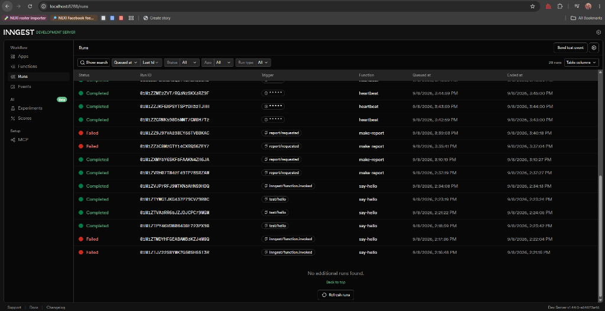

# Your First Background Job (FastAPI + Inngest)

A durable, event-driven background processing API built in **Python 3.11** with **FastAPI** and **Inngest**. The API decouples slow operations (e.g. 8-second report generation) from the HTTP request-response cycle using HTTP `202 Accepted`, client status polling, automated retries with exponential backoff, and a scheduled cron heartbeat.

Part of **FlyRank AI Backend Engineering Internship: Week 7 (Assignment BE_06 / Assignment A7: Your first background job)**.

---

## Stages & Checklist

- [x] **Stage 0: Hello, Server**: Create FastAPI server with GET /health returning status 200.
- [x] **Stage 1: Connect Inngest**: Install Inngest SDK, define `say-hello` function, connect to Inngest Dev Server, and invoke from dashboard.
- [x] **Stage 2: The Fast Door (Accept Now, Work Later)**: POST /reports returns 202 immediately, sends event to `make-report` (8s sleep + build), and GET /reports/:id polls status until done.
- [x] **Stage 3: Jobs Fail, Watch the Retry**: Add failure simulation for topic "fail", configure retries=2, watch exponential backoff, and reject missing topics with 400.
- [x] **Stage 4: The Clock Knocks (Cron Heartbeat)**: Add scheduled `heartbeat` cron function running every minute (`* * * * *`) and audit report status.
- [x] **Stage 5: Publish & Docs**: Complete documentation, add dashboard screenshots, verify clean clone instructions, and publish.

---

## How to Run (Two Documented Commands)

To run the full system, open two separate terminal windows:

### Terminal 1: FastAPI Web API
```bash
# In Week 7/backend/BE_06
source venv/Scripts/activate     # Windows Git Bash (or .\venv\Scripts\activate in PowerShell)
uvicorn main:app --reload --port 8000
```
API runs at: `http://localhost:8000`  
Swagger Documentation: `http://localhost:8000/docs`

### Terminal 2: Inngest Dev Server (Local Orchestrator & Dashboard)
```bash
npx inngest-cli@latest dev -u http://localhost:8000/api/inngest
```
Dev Dashboard runs at: `http://localhost:8288`

---

## System Architecture

### REST Endpoints

| Method | Endpoint | Status Code | Description |
|---|---|---|---|
| `GET` | `/health` | `200 OK` | Liveness health check. |
| `POST` | `/reports` | `202 Accepted` | The Fast Door. Validates input (rejects empty/missing topic with `400 Bad Request`), creates a pending report record, dispatches `report/requested` event to Inngest, and returns `{"id": "...", "status": "pending"}` in < 50ms. |
| `GET` | `/reports/{id}` | `200 OK` / `404 Not Found` | Status polling endpoint. Returns `status: "pending"` while running, `status: "done"` with `result` text when finished, or `status: "failed"` if unrecoverable. Returns 404 for unknown IDs. |

### Inngest Background Functions

| Function ID | Trigger | Behavior |
|---|---|---|
| `say-hello` | Event: `test/hello` | Introductory durable function. Executes step `sleep-5-seconds` via `ctx.step.sleep`, then returns `"Hello from the background!"`. |
| `make-report` | Event: `report/requested` | Multi-step worker with `retries=2`. Step 1 (`do-the-slow-work`) sleeps for 8 seconds. Step 2 (`build-report`) generates report text and marks store status `done`. If topic is `"fail"`, raises an exception to trigger retry with exponential backoff. |
| `heartbeat` | Cron: `* * * * *` | Scheduled automation running on the clock every minute. Audits in-memory store and logs count of pending, done, and failed reports. |

---

## Pasted Proof: The 202 Accepted and Status Polling

### 1. Requesting a Report (Instant 202 Accepted)
```bash
$ time curl -i -X POST http://localhost:8000/reports \
  -H "Content-Type: application/json" \
  -d '{"topic":"cats"}'

HTTP/1.1 202 Accepted
date: Tue, 08 Sep 2026 06:37:19 GMT
server: uvicorn
content-length: 36
content-type: application/json

{"id":"a6a4b0f0","status":"pending"}

real    0m0.038s
user    0m0.015s
sys     0m0.015s
```

### 2. Immediate Poll (Pending)
```bash
$ curl -i http://localhost:8000/reports/a6a4b0f0

HTTP/1.1 200 OK
date: Tue, 08 Sep 2026 06:37:23 GMT
server: uvicorn
content-length: 66
content-type: application/json

{"id":"a6a4b0f0","topic":"cats","status":"pending","result":null}
```

### 3. Follow-Up Poll ~10 Seconds Later (Done + Result)
```bash
$ curl -i http://localhost:8000/reports/a6a4b0f0

HTTP/1.1 200 OK
date: Tue, 08 Sep 2026 06:37:38 GMT
server: uvicorn
content-length: 147
content-type: application/json

{"id":"a6a4b0f0","topic":"cats","status":"done","result":"Comprehensive executive report on 'cats', generated after in-depth background analysis."}
```

---

## Stage 3 Reflection: Transient Failure vs Bad Input

A wrong input must be rejected at the door (HTTP 400); only a wrong moment (transient network or service failure) deserves a retry. Retrying a bad input 10 times will never make it valid, but retrying a transient glitch gives an external service time to recover.

---

## Stage 4 Reflection: Cron Schedules

- **Every day at 08:00:** The cron expression is `0 8 * * *`, which triggers at minute 0 of hour 8 every day.
- **Every Sunday at 22:00:** The cron expression is `0 22 * * 0`, which triggers at minute 0 of hour 22 on Sunday.

---

## Dashboard Verification

In the Inngest Dev Server dashboard (`http://localhost:8288`):
- `say-hello` completed with the 5-second sleep step.
- `make-report` completed with 8-second slow work and build steps.
- `make-report` with topic `"fail"` demonstrated 3 attempts with exponential backoff and ended in `Failed`.
- `heartbeat` cron executed once every minute automatically on the clock.



