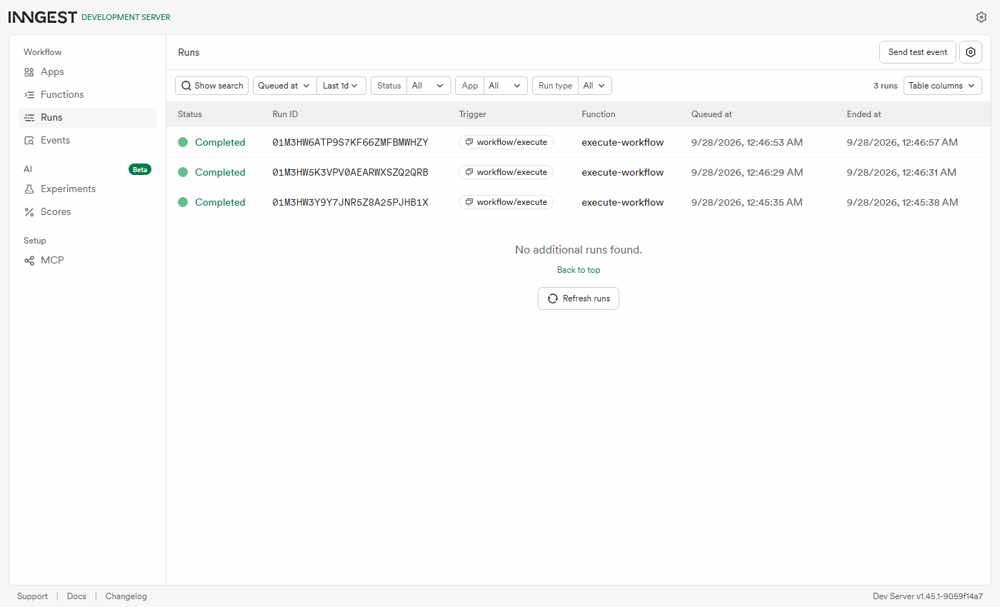
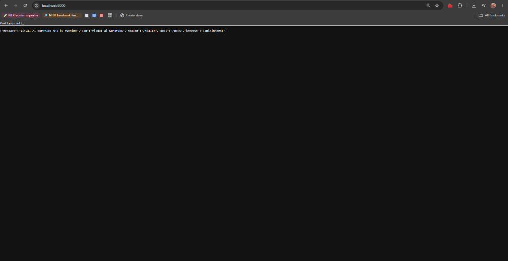
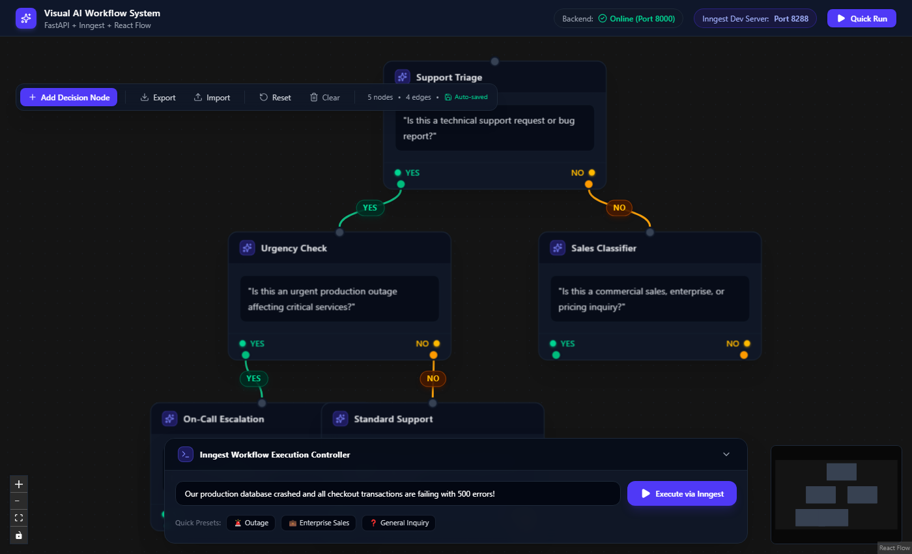
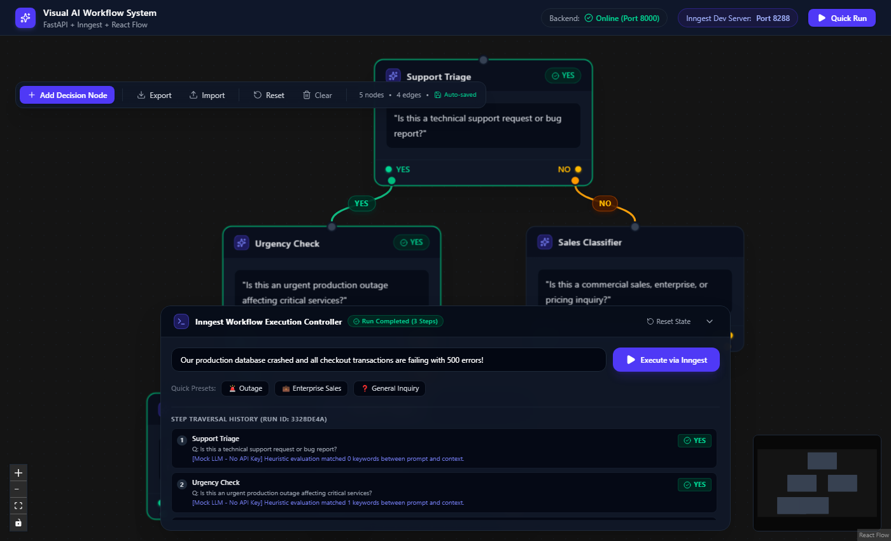

# Visual AI Workflow System (FastAPI + Inngest + React Flow)

An interactive visual AI workflow orchestration platform built with **Python 3.11**, **FastAPI**, **Inngest**, **OpenAI**, and **React Flow**. Each node represents an AI decision step returning strictly **YES** or **NO**. Workflow execution is orchestrated durably through Inngest background steps while the React frontend visualizes dynamic node traversal, animated branch paths, and execution logs in real-time.

Part of **FlyRank AI Backend Engineering Internship: Week 7 (Assignment BE_09 / Visual AI Workflow System)**.

---

## Stages & Checklist

- [x] **Phase 1: Setup**:
  - Python / FastAPI backend with Inngest SDK (`/api/inngest`), OpenAI client, CORS middleware, and `/health`.
  - React + TypeScript + Vite + Tailwind CSS frontend with React Flow (`@xyflow/react`).
  - Working Inngest Dev Server connection on port 8288.
- [x] **Phase 2: Foundations**:
  - Interactive React Flow canvas with custom Decision Nodes.
  - Distinct YES (green) and NO (amber) output handles.
  - Custom edge badges and prompt editing via Node Inspector.
  - LocalStorage auto-save for graph state.
- [x] **Phase 3: Build (Core)**:
  - Durable Inngest function `execute_workflow` mapping each node to an Inngest step.
  - LLM evaluates prompt against user input context, returning strictly `YES` or `NO`.
  - Dynamic branching to next node based on matching outgoing edge.
  - Traversal order tracking and run polling API (`GET /api/workflow/runs/{run_id}`).
- [x] **Phase 4: Build (Polish)**:
  - Visual execution states (running, completed-yes, completed-no, idle).
  - Animated flowing dash active edges with glow and scaled badges.
  - Inngest Execution Controller panel with quick presets, active spinner, and step traversal logs.
  - JSON graph export and import for workflow sharing and backup.

---

## How to Run (Three Terminals)

### Terminal 1: FastAPI Backend
```bash
# In Week 7/backend/BE_09
source venv/Scripts/activate     # Windows Git Bash (or .\venv\Scripts\activate in PowerShell)
uvicorn main:app --reload --port 8000
```
- API live at: `http://localhost:8000`
- Swagger Docs: `http://localhost:8000/docs`
- Health check: `http://localhost:8000/health`

### Terminal 2: Inngest Dev Server (Orchestrator)
```bash
npx inngest-cli@latest dev -u http://127.0.0.1:8000/api/inngest
```
- Inngest Dashboard: `http://localhost:8288`

### Terminal 3: React Flow Frontend
```bash
# In Week 7/backend/BE_09/frontend
npm run dev
```
- Interactive Visual Canvas: `http://localhost:5173`

---

## System Architecture

```
React Flow Canvas (Port 5173)
       │
       │ POST /api/workflow/execute { context, nodes, edges }
       ▼
FastAPI Server (Port 8000)
       │
       │ Inngest Event: workflow/execute
       ▼
Inngest Orchestrator (Port 8288)
       │
       ├── Step 1: Evaluate Node 1 (LLM Decision: YES or NO)
       ├── Follow Edge: YES -> Node 2 | NO -> Node 3
       ├── Step 2: Evaluate Node 2 (LLM Decision: YES or NO)
       └── Complete Workflow Run
       ▲
       │ Polling GET /api/workflow/runs/{run_id}
React Flow Canvas (Illuminates active nodes & animated edges in real-time)
```

---

## Verification Screenshots

### 1. Inngest Dev Server (Port 8288)
Connected and synchronized with FastAPI (`http://localhost:8000/api/inngest`), discovering `visual-ai-workflow` with 1 background function (`execute-workflow`).



### 2. FastAPI Root (Port 8000)
REST API live response at `http://localhost:8000`.



### 3. React Flow Visual Canvas (Port 5173)
Interactive canvas with dark styling, custom AI icon, and live backend connection badge.



### 4. Live Inngest Workflow Execution & Step Traversal
Live workflow execution running through Inngest with real-time illuminated nodes, traversed branches, active status indicators, and step execution logs.


